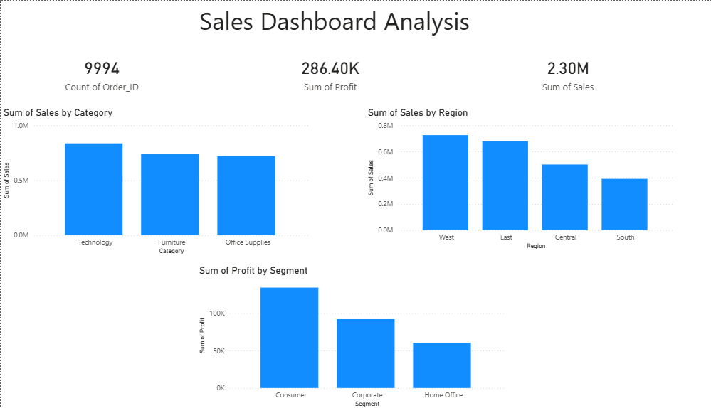

# 📊 Data Analytics & Business Intelligence Project

## 📌 Project Overview
This project demonstrates an end-to-end data analytics workflow including data cleaning, exploratory data analysis (EDA), SQL-based analysis, and dashboard visualization.

The goal is to extract meaningful business insights from raw data and present them in a clear and interactive format.

---

## 🛠 Tools & Technologies Used
- Microsoft Excel (Data Cleaning & EDA)
- SQL (Data Analysis)
- Power BI (Dashboard Visualization)

---

## 📂 Project Structure
Data-Analytics-Task-1/
│
├── data/
│ ├── raw_data.csv
│ └── cleaned_data.xlsx
│
├── sql/
│ └── analysis.sql
│
├── dashboard/
│ ├── dashboard.pbix
│ └── dashboard.png
│
├── report/
│ ├── insights.md
│ ├── eda_screenshots/
│ └── sql_screenshots/
│
└── README.md

---

## 📊 Dashboard Preview

---

## 🔍 Key Analysis Performed
- Data Cleaning and Preprocessing
- Exploratory Data Analysis using Pivot Tables
- SQL Queries using GROUP BY, SUM, AVG
- Dashboard creation with interactive filters

---

## 💡 Key Insights
- Technology category generates the highest sales.
- West region shows strong performance in revenue.
- High discounts negatively impact profitability.
- A small group of customers contributes significantly to total sales.

---

## 🚀 Skills Demonstrated
- Data Cleaning
- Data Analysis
- SQL Query Writing
- Data Visualization
- Business Insight Generation

---

## 🧾 Conclusion
This project highlights how raw data can be transformed into actionable insights using analytical tools and visualization techniques.

---

## 📬 Contact
If you have any questions or suggestions, feel free to connect!

